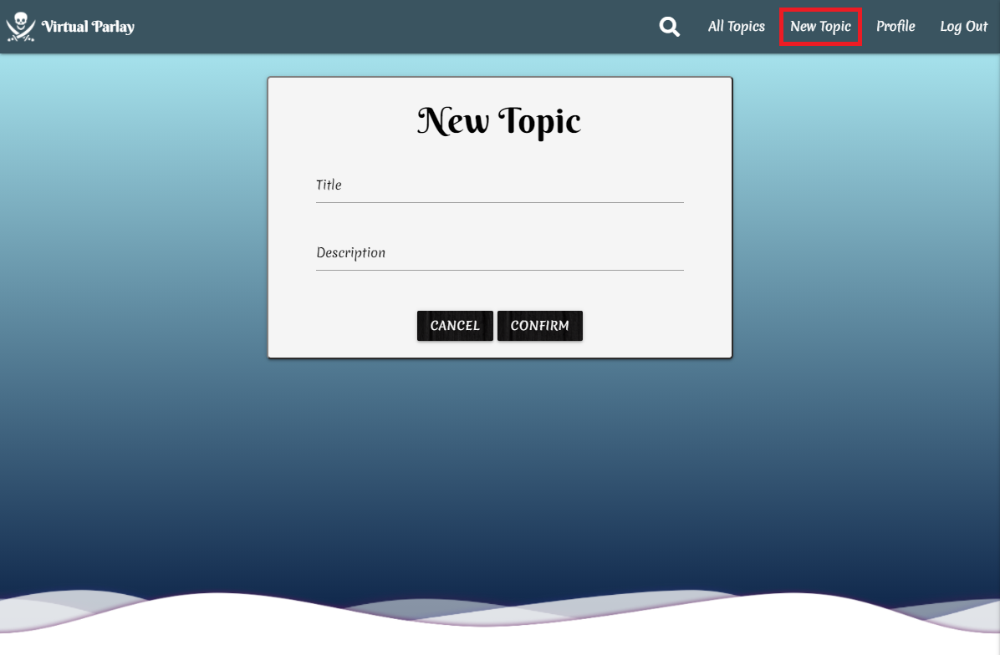
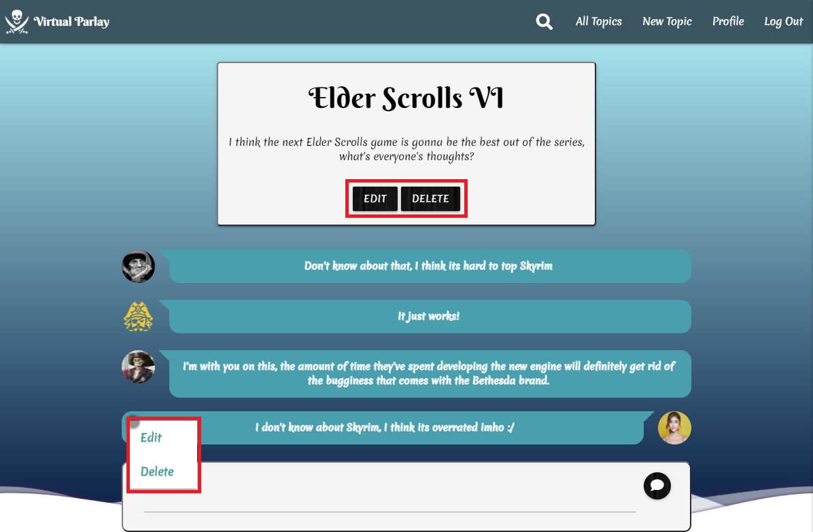
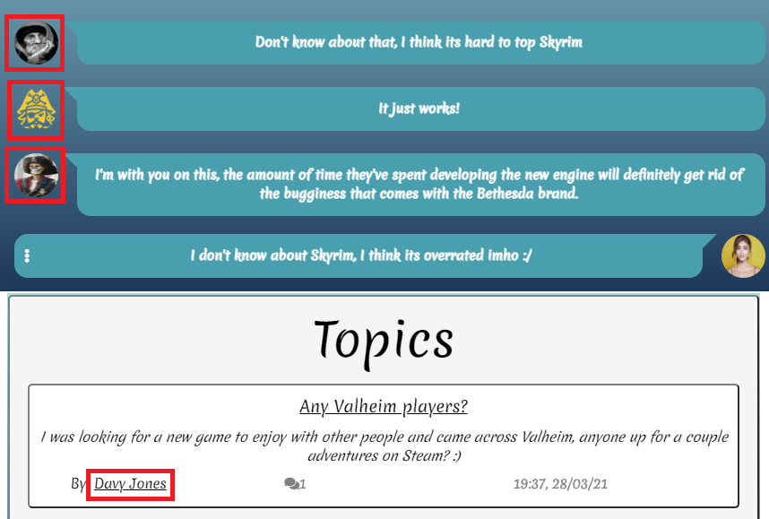
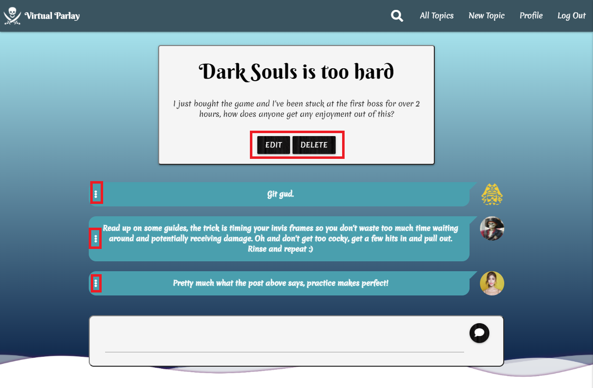

Go back to original [document](https://github.com/JuanBrachoDev/Virtual-Parlay/tree/master/README.md).

### Validation

---

The W3C Markup Validator, W3C CSS Validator Services, JSHint, PEP8 Online and Chrome Lighthouse were used to validate and test every page and file of the project to ensure there were no errors. 

-   [W3C Markup Validator](https://validator.w3.org/#validate_by_input) - [Results](https://github.com/JuanBrachoDev/Virtual-Parlay/tree/master/docs/readme/validation/html)
    >   All pages were validated with no mistakes except for edit_profile as access to that page is restricted unless the user has the appropiate session cookie, validated with raw code and only got errors associated with the templating language.
-   [W3C CSS Validator](https://jigsaw.w3.org/css-validator/#validate_by_input) - [Results](https://github.com/JuanBrachoDev/Virtual-Parlayr/tree/master/docs/readme/validation/css)
    >   All CSS filed validated successfully.
-   [JSHint](https://jshint.com/) - [Results](https://github.com/JuanBrachoDev/Virtual-Parlay/tree/master/docs/readme/validation/js)
    >   Results show unused variables but ignoring those warnings as the functions are not used within the same file.
-   [PEP8 Online](http://pep8online.com/) - [Results](https://github.com/JuanBrachoDev/Virtual-Parlay/tree/master/docs/readme/validation/python)
    >   All python code is PEP8 compliant.
-   [Google Chrome Lighthouse](https://developers.google.com/web/tools/lighthouse) - [Results](https://github.com/JuanBrachoDev/Virtual-Parlay/tree/master/docs/readme/validation/lighthouse)
    >   Test shows accessibility issues, like missing label for search input in navbar, the label is correct however since it's "for" attribute matches the input's "id".

### Responsiveness

---

The main tool to test all pages for responsiveness was Chrome DevTools. Personal devices were used as well.

Here is a list of all devices tested:

| Mobile | Tablet | Desktop |
| :-: | :-: | :-: |
| Moto G4 | iPad | Acer (27") - 16:9 |
| Galaxy S5/J7 | iPad Pro | MacBook Pro (15") |
| Pixel 2/2 XL | iPad Mini | |
| iPhone 5/SE | Kindle Fire | |
| iPhone 6/7/8 | | |
| iPhone 6/7/8 Plus | | |
| iPhone X | | |

### Testing User Stories from User Experience (UX) Section

---

-   #### As an user I need to:

    - Be able to register, log in and log out.
        > I can select the "register" and "log in" pages from the menu when initially accessing the webpage, and I can choose to log out once I am logged in.
        

    - Be able to open a new topic so I can discuss a game with other users.
        > I can select "New Topic" from the menu once I am logged in, I can fill in the form and a new topic will be created for me.
        

    - Be able to modify and delete my own topics and posts.
        > I can enter my topic from the index page and within the discussion I can edit/delete the topic by clicking the respective buttons underneath the topic information, and also be able to edit/delete any of my own posts by clicking the dotted menu on each post.
        

    - Be able to look at other user's profiles.
        > I can access other user's profiles by clicking on their portrait in a topic's discussion or by clicking the topic's author from the index page.
        

    - Be able to modify my own profile.
        > I can modidy it by clicking the edit profile button within my profile and filling the form.
        
        
-   #### As an admin I need to:

    - Be able to log in and log out.
        > I can select the "log in" page from the menu when initially accessing the webpage, and I can choose to log out once I am logged in.
        

    - Be able to open a new topic so I can discuss a game with other users.
        > I can select "New Topic" from the menu once I am logged in, I can fill in the form and a new topic will be created for me.
        

    - Be able to modify and delete any user's topics and posts.
        > I can enter any topic from the index page and within the discussion I can edit/delete the topic by clicking the respective buttons underneath the topic information, and also be able to edit/delete any posts by clicking the dotted menu on each post.
        

    - Be able to look at and modify any user's profiles.
        > I can access any user's profiles by clicking on their portrait in a topic's discussion or by clicking the topic's author from the index page. Then I can modidy it by clicking the edit profile button within the profile and filling the form.
        

### Functionality Testing

---

The following features were tested for **base.html**:

| Feature | Expected Behaviour | Testing Method | Result |
| :-: | :-: | :-: | :-: |
| Logo | Functions as a link to **index**, "Virtual Parlay" text should be hidden on small devices. | Logo links correctly and text is hidden on small devices. | Passed |
| Search Input | Should hide the input field unless `onFocus()` event is triggered. When a search term is submitted it links to **index** with a curated topic list related to the search term. | Search input field hides and shows correctly. Entered "Valheim" and only the topic about Valheim shows. Entered "Mario" and no topics show. Entered "game" and all topics show. | Passed |
| Button Menu | Should link to **index** and **create_topic** at all times, should link to **register** and **login** if user isn't logged in, should link to  **profile** and **logout** if user is logged in. | Buttons for **index**, **create_topic**, **register**, **login** show when logged out, upon login it shows buttons for **index**, **create_topic**, **profile**, **logout**. All links function correctly.  | Passed |
| Burger Menu | Should replace the button menu on small devices and should trigger a sidenav with the same functionality as the button menu. | Burger menu button only shows on small devices and successfully replaces the button menu. Links for **index**, **create_topic**, **register**, **login** show when logged out, upon login it shows links for **index**, **create_topic**, **profile**, **logout**. All links function correctly. | Passed |
| Flash Messages Section | Whenever a message is flashed it should show below navbar and above content block. | Logged in and welcome message shows below navbar and profile content. | Passed |
| Background Waves | Should show a wave animation at all times. | Waves are correctly displaying on all pages. | Passed |

The following features were tested for **create_topic.html**:

| Feature | Expected Behaviour | Testing Method | Result |
| :-: | :-: | :-: | :-: |
| New Topic Form | "Title" should only accept inputs between 5 to 40 characters long, "Description" should accept inputs between 5 and 200 characters long. "Cancel" button should redirect to **index**, "Confirm" button should only work when all inputs have been validated, create the new post and redirect to **index**. Accessing this page without having an user session should redirect to **login** page.  | Tested if inputs would validate correctly with too short and too long inputs, and they didn't. Upon clicking the "Cancel" button it redirects to **index** successfully, "Confirm" button also redirects succesfully and only works when all inputs are validated. New topic also shows in database after submitting the form. Logged out and tried accessing the page and was redirected to **login**. | Passed |

The following features were tested for **discussion.html**:

| Feature | Expected Behaviour | Testing Method | Result |
| :-: | :-: | :-: | :-: |
| Topic Section | Should only show Edit/Delete buttons to topic owner and admins. | Logged in as another user than creator and buttons don't show. Logged in as the topic's author and buttons show correctly. Logged in as admin and buttons show correctly. | Passed |
| Topic Edit | Should replace topic information with edit form. "Cancel" button should link back to same **discussion** topic, "Confirm" button should only work if both inputs are succesfully validated and redirect to same **discussion** topic with updated information. |  Tested if inputs would validate correctly with too short and too long inputs, and they didn't. Upon clicking the "Cancel" button it redirects to **discussion** successfully, "Confirm" button also redirects succesfully and only works when all inputs are validated. Topic shows as updated in database after submitting the form. | Passed |
| Topic Delete | Should trigger confirmation modal, modal should just close on "Cancel" and should close and delete topic on "Confirm" | Modal functions correctly and topic is successfully removed from database upon confirmation within modal.  | Passed |
| Posts Section | Should show all posts associated with the topic along with a small portrait of their authors, and show the text area to enter a new post if logged in. It should also show own posts oriented to the right if logged in as author or admin along with their edit buttons, and show other posts oriented to the left. | Logged in as one of the posts authors and all posts show correctly, the text area to enter a new post is also present. Logged out and all posts show as expected. Logged in as admin and all posts show with their edit buttons. | Passed |
| Create Post Input | Should add a new post to the topic and reload the page so it shows the changes. | Logged in with an account and successfully created a new post by typing into the text area and pressing the submit button. | Passed |
| Post Profile Miniature | All posts should have their author's profile miniature next to them, and they should link to their profiles. | Tested all miniatures within a topic and they all linked to their authors correctly. | Passed |
| Post Edit | Should replace post content with an input with the same content, "Save" button should update the post, "Cancel" button should hide the input and show the post again. | Input shows correctly. Clicked on "Save" and "Submit" buttons and they function as expected. | Passed |
| Post Delete | Should delete the post from the database and reload the page without the post. | Selected "Delete" option and it successfully removes post from database and reloads the page correctly. | Passed |

The following features were tested for **edit_profile.html**:

| Feature | Expected Behaviour | Testing Method | Result |
| :-: | :-: | :-: | :-: |
| Edit Profile Form | "Display Name" should only accept names between 5 and 15 characters and stick to the pattern of allowed characters. "Profile Image" upload should limit file size to 5MB and show an error message if a larger file is selected. "Cancel" button should bring user back to **profile** page,  | Tried different characters and lengths for the "Display Name" and it only accepted those matching the pattern. "Profile Image" upload shows error message when a file larger than 5MB is selected and hides when a valid file is entered. User collection is successfully changed upon form submission and user is redirected to updated **profile**. | Passed |

The following features were tested for **index.html**:

| Feature | Expected Behaviour | Testing Method | Result |
| :-: | :-: | :-: | :-: |
| Topics Section | All topics should show their title, description, author, number of posts and date of creation. Topics should be ordered by date with the most recent on top. | All topics display in the correct order and all expected information is shown. | Passed |
| Topic Title | Title should link to the associated **discussion** page. | Clicked on topics titles and they link to the correct **discussion** pages. | Passed |
| Topics Author | Author should link to the creator's **profile**. | Clicked on authors and they link to the correct **profile** pages. | Passed |

The following features were tested for **login.html**:

| Feature | Expected Behaviour | Testing Method | Result |
| :-: | :-: | :-: | :-: |
| Login Form | "Email" field should only accept emails. "Password" field should only accept passwords between 8 and 40 characters long. Upon form submission users should be redirected to their **profile** page. | Tried different inputs in both fields and both validated expected values only. Succesffuly redirected to correct **profile** page upon form submission. | Passed |

The following features were tested for **profile.html**:

| Feature | Expected Behaviour | Testing Method | Result |
| :-: | :-: | :-: | :-: |
| Profile Section | Section should contain the user's display name and picture. "Edit Profile" button should only show for the owner and admins. | Tried different accounts and all information was displayed as expected. "Edit Profile" button only showed for owners and admins. | Passed |
| Edit Profile Button | Should link to **edit_profile** for the associated user. | Clicked button and was successfully redirected to the correct **edit_profile** page. | Passed |

The following features were tested for **register.html**:

| Feature | Expected Behaviour | Testing Method | Result |
| :-: | :-: | :-: | :-: |
| Register Form | "Display Name" should be between 5 to 15 characters long and only accept the pattern entered in the html file. "Email" field should only accept emails. "Password" field should only accept passwords between 8 and 40 characters long. "Confirm Password" should check that it matches the value of "Password" on every key-up in both fields. Upon form submission users should be redirected to their newly created **profile** page. | Tried different inputs in all fields and both validated expected values only. "Confirm Password" updated on every keyup. Succesffuly redirected to correct **profile** page upon form submission. | Passed |
    
### UX Testing

---

-   The Website was tested on Google Chrome, Microsoft Edge, and Mozilla Firefox browsers.
-   Friends and family members were asked to review the site and documentation to point out any errors, bugs and/or user experience issues.

### Fixed Bugs

---

-   Search field would reset on every page load, showing animation of show and hide despite not being active.
       > Added the class `.search-load` that is removed on first interaction with the search field, this class lacks the animation and allows the field to be initiallized without showing anything to the user.

-   Profile Image would not change until profile page was hard reloaded.
       > Removed caching for project, allowing the newly uploaded image to automatically load within the profile.

-   Profile Image wasn't saving correctly after editing profile.
       > Passed `user_id` as "str" into `save_profile_image()` since it was taking the id as "ObjectId" instead, and wouldn't be able to update the image with a path of type "ObjectId".

-   Edit Post button would sometimes choose Delete when clicked or not work at all on small devices.
       > Adjusted padding and margins since it was causing selection issues along with the small space available for buttons to display.

### Known Bugs

---

-   Profile picture upload accepts any file type.
    > While upload explorer initially only shows image files because of the `accept="image/"*` attribute, users can still circumvent by selecting "All files" in the explorer and upload other types long as the file is under 5MB.